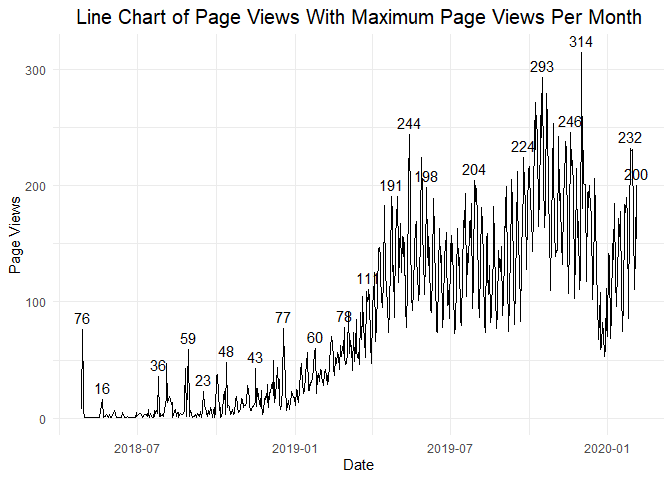
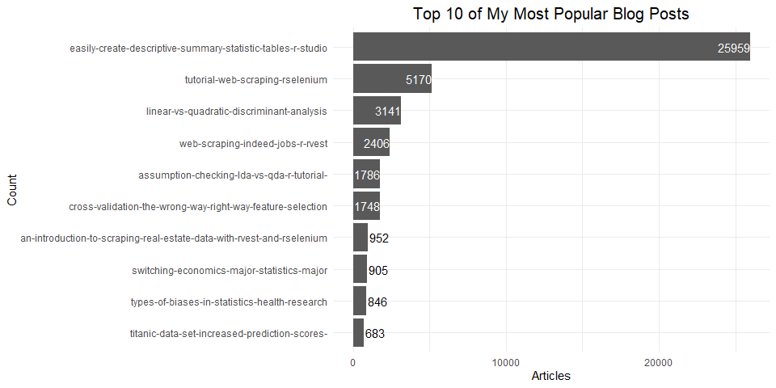
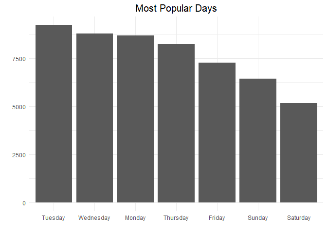
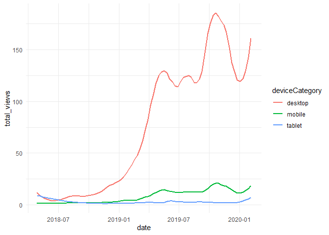
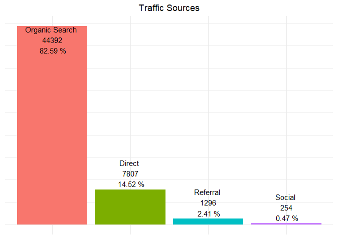
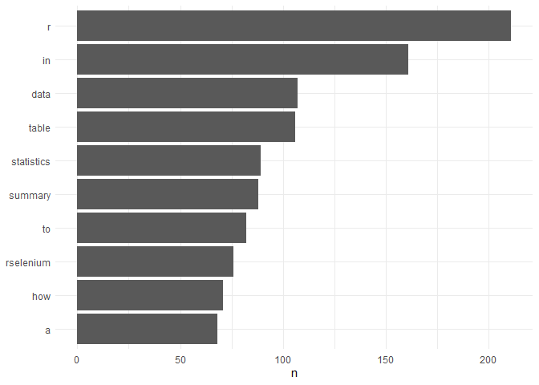
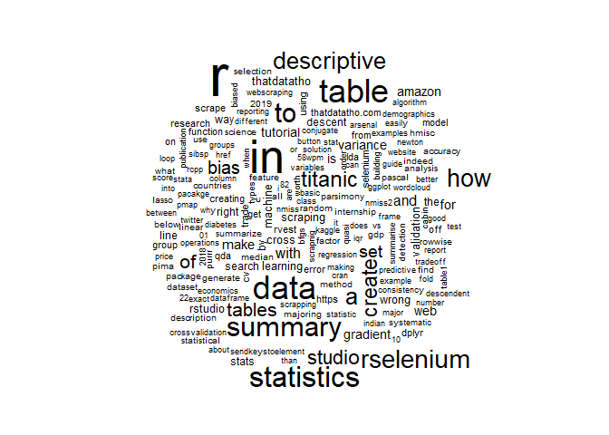

Google Analytics & R
================
Pascal Schmidt
February 4, 2020

``` r
library(tidyverse)
library(tidytext)
library(igraph)
library(ggraph)
library(wordcloud)
```

``` r
# Ran last on February 4th, 2020
# library(googleAnalyticsR)
# googleAnalyticsR::ga_auth()
# 
# my_accounts <- ga_account_list()
# my_ID <- my_accounts %>%
#   dplyr::pull(viewId) %>%
#   as.integer()
# 
# web_data <- google_analytics(my_ID, 
#                              date_range = c("2018-01-15", "today"),
#                              metrics = c("sessions","pageviews", 
#                                          "entrances","bounces", "bounceRate", "sessionDuration"),
#                              dimensions = c("date","deviceCategory", "hour", "dayOfWeekName",
#                                             "channelGrouping", "source", "keyword", "pagePath"),
#                              anti_sample = TRUE)
# 
# write.csv(web_data, "data/web_data.csv", row.names = F)

web_data <- readr::read_csv("data/web_data.csv")
```

    ## Parsed with column specification:
    ## cols(
    ##   date = col_date(format = ""),
    ##   deviceCategory = col_character(),
    ##   hour = col_character(),
    ##   dayOfWeekName = col_character(),
    ##   channelGrouping = col_character(),
    ##   source = col_character(),
    ##   keyword = col_character(),
    ##   pagePath = col_character(),
    ##   sessions = col_double(),
    ##   pageviews = col_double(),
    ##   entrances = col_double(),
    ##   bounces = col_double(),
    ##   bounceRate = col_double(),
    ##   sessionDuration = col_double()
    ## )

``` r
web_data %>% 
  dplyr::as_tibble() -> web_data
```

### Blog Development Over Time

``` r
web_data %>%
  dplyr::group_by(date) %>%
  dplyr::summarise(total_views = sum(pageviews)) %>%
  dplyr::ungroup() %>%
  dplyr::mutate(month = lubridate::month(date, label = TRUE),
                year = lubridate::year(date)) %>%
  tidyr::unite("month_year", month, year, sep = "-", remove = TRUE) %>%
  dplyr::group_by(month_year) %>%
  dplyr::mutate(max_view_month = max(total_views),
                max_view_month = base::ifelse(max_view_month == total_views, 
                                              max_view_month, 
                                              NA)) -> total_views

ggplot(total_views, aes(x = date, y = total_views)) +
  geom_line() +
  geom_text(aes(label = max_view_month), check_overlap = TRUE, vjust = -0.5) +
  theme_minimal() +
  ggtitle("Line Chart of Page Views With Maximum Page Views Per Month") +
  theme(plot.title = element_text(hjust = 0.5, size = 15)) +
  xlab("Date") +
  ylab("Page Views")
```

<!-- -->

  - I have been blogging since January 2018 and we can see my blog has
    been growing since then. As of February 2020, I am averaging around
    4,000 page views per month.
  - Also, in December 2019, I reached my highest page views so far with

### What Blog Posts generate the most Traffic?

``` r
web_data %>%
  dplyr::group_by(pagePath) %>%
  dplyr::summarise(n = sum(pageviews)) %>%
  dplyr::arrange(desc(n)) %>%
  dplyr::mutate(pagePath = stringr::str_remove_all(pagePath, "([[0-9]]|\\/)")) %>%
  dplyr::filter(pagePath != "") %>%
  .[1:10, ] %>%
  dplyr::arrange(n) %>%
  dplyr::mutate(pagePath = factor(pagePath, levels = pagePath)) -> top_10_articles


ggplot(top_10_articles, aes(x = pagePath, y = n)) +
  geom_bar(stat = "identity") +
  geom_text(data = top_10_articles %>%
              .[5:10, ], aes(label = n), hjust = 1, color = "white") +
  geom_text(data = top_10_articles %>%
              .[1:4, ], aes(label = n), hjust = -0.1, color = "black") +
  theme_minimal() +
  theme(plot.title = element_text(hjust = 0.5, size = 15)) +
  coord_flip() +
  ylab("Articles") +
  xlab("Count") +
  ggtitle("Top 10 of My Most Popular Blog Posts")
```

<!-- -->

### What Days of the Week and Hours are Most Successful?

``` r
web_data %>%
  dplyr::group_by(dayOfWeekName) %>%
  summarise(n = sum(pageviews)) %>%
  dplyr::arrange(desc(n)) %>%
  dplyr::mutate(dayOfWeekName = factor(dayOfWeekName, levels = dayOfWeekName)) -> week_day

ggplot(week_day, aes(x = dayOfWeekName, y = n)) +
  geom_bar(stat = "identity") +
  theme_minimal() +
  xlab("") +
  ylab("") +
  theme(plot.title = element_text(hjust = 0.5, size = 15)) +
  ggtitle("Most Popular Days")
```

<!-- -->

``` r
web_data %>%
  dplyr::group_by(date, deviceCategory) %>%
  dplyr::summarise(total_views = sum(pageviews)) -> device_cat

ggplot(device_cat, aes(x = date, y = total_views, col = deviceCategory)) +
  geom_smooth(se = F, span = 0.2) +
  theme_minimal()
```

    ## `geom_smooth()` using method = 'loess' and formula 'y ~ x'

<!-- -->

``` r
web_data %>%
  dplyr::group_by(channelGrouping) %>%
  dplyr::summarise(total_views = sum(pageviews)) %>%
  dplyr::mutate(prop = round(total_views / sum(total_views), 4) * 100) %>%
  dplyr::arrange(desc(total_views)) %>%
  dplyr::mutate(channelGrouping = factor(channelGrouping, levels = channelGrouping)) -> source

ggplot(source, aes(x = channelGrouping, y = total_views, fill = channelGrouping)) +
  geom_bar(stat = "identity") +
  geom_text(data = source %>%
              .[1, ], aes(label = paste(channelGrouping, "\n", total_views, "\n", prop, "%")),
            vjust = 1) +
  geom_text(data = source %>%
              .[2:4, ], aes(label = paste(channelGrouping, "\n", total_views, "\n", prop, "%")),
            vjust = -0.1) +
  theme_minimal() +
  theme(axis.text = element_blank(),
        axis.title = element_blank(),
        plot.title = element_text(hjust = 0.5),
        legend.position = "none") +
  ggtitle("Traffic Sources")
```

<!-- -->

``` r
web_data %>%
  dplyr::select(keyword) %>%
  dplyr::filter(!(keyword %in% c("(not set)", "(not provided)"))) %>%
  tidytext::unnest_tokens(word, keyword) -> key_words
  
key_words %>%
  dplyr::count(word, sort = TRUE) %>%
  .[1:10, ] %>%
  dplyr::mutate(word = stats::reorder(word, n)) %>%
  ggplot(aes(x = word, y = n)) +
  geom_col() +
  xlab(NULL) +
  coord_flip() +
  theme_minimal()
```

<!-- -->

``` r
key_words %>%
  dplyr::count(word) %>%
  with(wordcloud::wordcloud(word, n))
```

<!-- -->

``` r
key_words %>%
  dplyr::mutate(word = stringr::str_remove_all(word, "[[0-9]]")) %>%
  dplyr::count(word) %>%
  dplyr::filter(n > 10) %>%
  igraph::graph_from_data_frame() -> bigram

a <- grid::arrow(type = "closed", length = unit(0.15, "inches"))
ggraph(bigram, layout = "fr") +
  geom_edge_link() +
  geom_node_point() +
  geom_node_text(aes(label = name), vjust = 1, hjust = 1) +
  theme_void()
```

<!-- -->
